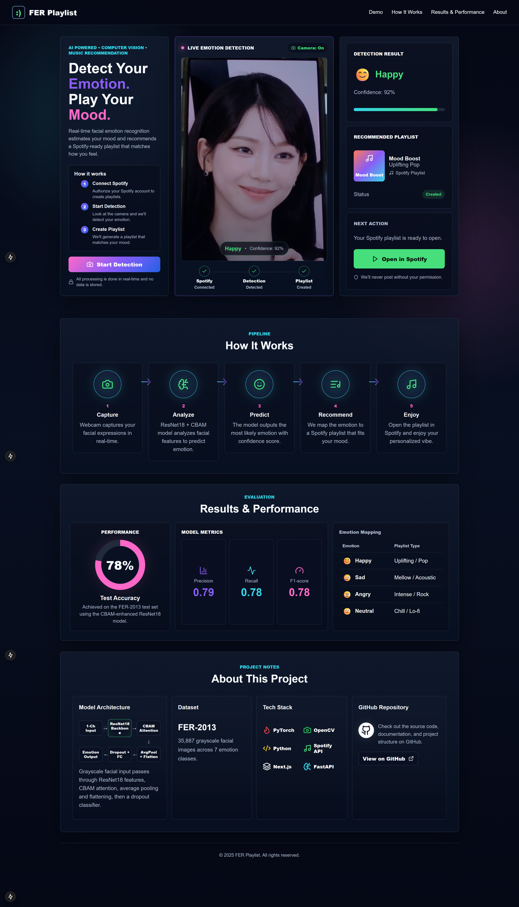
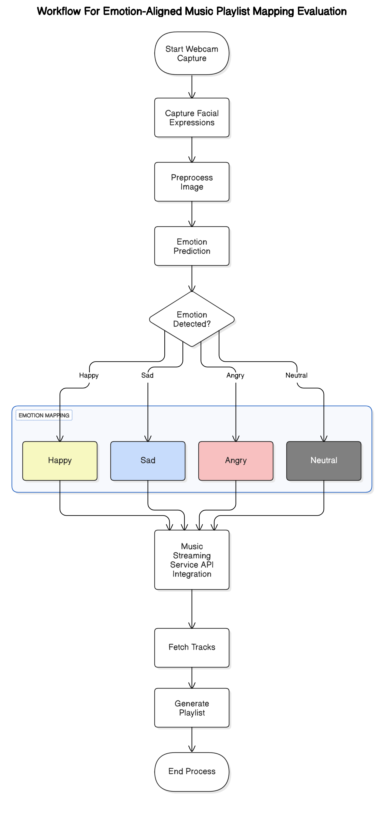

# FER Music Playlist

FER Music Playlist is a single-page web application that detects a user's facial emotion from a webcam feed and recommends a Spotify playlist that matches the detected mood. The project combines facial emotion recognition, deep learning inference, and Spotify playlist generation in one interactive demo.

The emotion recognition model is based on ResNet18 enhanced with CBAM attention and trained using the FER-2013 dataset. The current web app uses a Next.js frontend, FastAPI backend, PyTorch/OpenCV inference layer, and Spotify Web API integration.

## Web App Preview



## Key Features

- Real-time webcam-based facial emotion detection demo
- ResNet18 + CBAM model architecture for FER classification
- Spotify account connection through the Spotify Web API
- Emotion-to-playlist recommendation flow
- Playlist creation and Spotify redirect support
- Dashboard-style project sections for workflow, metrics, architecture, dataset, and tech stack

## Tech Stack

| Layer | Technology |
|---|---|
| Frontend | Next.js, React, TypeScript, CSS |
| Backend | FastAPI, Uvicorn, Python |
| Inference | PyTorch, TorchVision, OpenCV, Pillow |
| Music API | Spotify Web API |
| Dataset | FER-2013 dataset |

## Project Structure

```text
FER-MusicPlaylist/
├── backend/                    # FastAPI backend and inference API
│   ├── app/
│   │   ├── main.py             # API routes for health, prediction, Spotify auth, playlists
│   │   ├── config.py           # Environment variable configuration
│   │   ├── inference.py        # Emotion classifier loading/prediction logic
│   │   ├── schemas.py          # API request/response models
│   │   └── spotify.py          # Spotify login, search, and playlist creation logic
│   └── requirements.txt        # Backend Python dependencies
├── frontend/                   # Next.js single-page web app
│   ├── src/app/                # App shell, page, and global styles
│   ├── src/components/         # UI components such as camera/demo sections
│   └── src/lib/                # Frontend API helper functions
├── fer-musicplaylist-jupyter/  # Research notebook workspace
├── docs/                       # README images and project diagrams
└── README.md
```

## How It Works

1. The user connects Spotify from the web app.
2. The user starts webcam detection.
3. The app captures a facial expression and sends it to the backend.
4. The backend predicts the emotion using the FER model, or mock mode during demo setup.
5. The app maps the detected emotion to a playlist mood.
6. The backend creates a Spotify playlist and returns the Spotify playlist link.

## Model Architecture
Designed architecture diagram:



## Emotion-to-Playlist Mapping

| Detected Emotion | Playlist Type |
|---|---|
| Happy | Uplifting / Pop |
| Sad | Mellow / Acoustic |
| Angry | Intense / Rock |
| Neutral | Chill / Lo-fi |

## Dataset

- Dataset: FER-2013
- Image format: grayscale facial expression images
- Emotion classes: 7 total classes in the original dataset
- Project demo mapping focuses on Happy, Sad, Angry, and Neutral
- Source: [FER-2013 Kaggle Dataset](https://www.kaggle.com/datasets/msambare/fer2013)

The dataset is not committed to this repository because it contains many image files and would make the repository too large.

## Model & Large File Notice

Large local files are excluded from GitHub, including the dataset, virtual environments, frontend dependencies, build output, and model weights.

To run real model inference, place the trained model file here:

```text
backend/app/models/model_5e5.pth
```

For demo/development mode, keep this in `backend/.env`:

```env
MOCK_INFERENCE=true
```

To use the trained model instead, set:

```env
MOCK_INFERENCE=false
```

## Setup & Run

### 1. Clone the repository

```sh
git clone https://github.com/Renagoh123/FER-MusicPlaylist.git
cd FER-MusicPlaylist
```

### 2. Set up the backend

```sh
cd backend
python -m venv .venv
.\.venv\Scripts\activate
pip install -r requirements.txt
uvicorn app.main:app --reload --host 127.0.0.1 --port 8000
```

The backend runs at:

```text
http://127.0.0.1:8000
```

Health check:

```text
http://127.0.0.1:8000/api/health
```

### 3. Set up the frontend

Open a second terminal:

```sh
cd frontend
npm install
npm run dev
```

The frontend runs at:

```text
http://localhost:3000
```

## Environment Variables

Create a local environment file at:

```text
backend/.env
```

Example:

```env
APP_ENV=development
FRONTEND_ORIGIN=http://localhost:3000
API_BASE_URL=http://127.0.0.1:8000
MOCK_INFERENCE=true

SPOTIFY_CLIENT_ID=your_spotify_client_id
SPOTIFY_CLIENT_SECRET=your_spotify_client_secret
SPOTIFY_REDIRECT_URI=http://127.0.0.1:8000/api/spotify/callback

CORS_ORIGINS=http://localhost:3000,http://127.0.0.1:3000
```

In the Spotify Developer Dashboard, add this redirect URI:

```text
http://127.0.0.1:8000/api/spotify/callback
```

Do not commit `.env`, `backend/.env`, `kaggle.json`, model weights, datasets, `node_modules`, `.next`, or virtual environments.

## Results & Performance

The CBAM-enhanced ResNet18 model achieved approximately 78% test accuracy on the FER-2013 test set. The web app displays model metrics such as precision, recall, and F1-score as part of the project dashboard.

## Future Improvements

- Deploy the frontend and backend for public access
- Add user-selectable playlist styles for each emotion
- Store playlist history after user consent
- Improve real-time inference performance
- Expand the recommendation mapping to all FER-2013 emotion classes

## License

This project is provided for academic and portfolio purposes. 