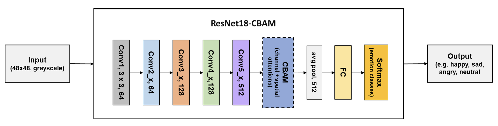

# 🎶Facial Emotion Recognition for Emotion-Based Playlist Mapping 

This project presents a deep learning-based system for **Facial Emotion Recognition (FER)** and **emotion-driven music recommendation**. Using a webcam feed, the system detects real-time facial emotions and maps them to curated Spotify playlists. At the core is a **ResNet18 model enhanced with CBAM (Convolutional Block Attention Module)**, trained on the FER-2013 dataset to improve emotion classification accuracy.

The CBAM-enhanced ResNet18 achieved **78% test accuracy**, outperforming baseline CNN models. The project showcases the synergy between computer vision and music recommendation APIs, highlighting the potential of **affective computing** in user-centric media experiences.

>  Note: The project report is intentionally not included to protect original academic documentation._

## Key Features
- 🎭 Real-time facial emotion detection from webcam
- 🧠 Deep learning model using **ResNet18 + CBAM**
- 🎵 Spotify playlist mapping based on detected mood
- 📊 Evaluation with Accuracy, Precision, Recall, F1-score
- 🔄 FER-to-Playlist loop: face → emotion → music


## Model Architecture
Below is a simplified version of the model used in this project:


> _The architecture enhances ResNet18 with CBAM attention blocks to focus on key spatial and channel features relevant to emotion detection._

## Workflow
The following diagram illustrates the complete system workflow — from capturing a user's facial expression to generating an emotion-aligned playlist:



## Emotion-to-Playlist Mapping
| Detected Emotion | Playlist Type          |
|------------------|------------------------|
| Happy            | Uplifting / Pop        |
| Sad              | Mellow / Acoustic      |
| Angry            | Intense / Rock         |
| Neutral          | Chill / Lo-fi          |


## Dataset
- **FER-2013**: 32,000 grayscale images (48x48 resolution)
- Emotion classes: 7 total → used 4 (Happy, Sad, Angry, Neutral)
- Data augmentation: rotation, flip, occlusion simulation
- Source: [Kaggle Dataset](https://www.kaggle.com/datasets/msambare/fer2013)
  

## Technologies Used
- **Python**, **PyTorch**, **OpenCV**
- **Spotify Web API** via [`spotipy`](https://spotipy.readthedocs.io/)
- **Google Colab** for model training
- **pandas**, **matplotlib**, **scikit-learn** for evaluation


## To Run the Project
1. Clone the repository:
   ```sh
   git clone https://github.com/yourusername/FER-MusicSync.git
   cd FER-MusicSync

2. Set up your .env file (for Spotify API credentials):
   ```sh
   SPOTIPY_CLIENT_ID=your_client_id
   SPOTIPY_CLIENT_SECRET=your_client_secret
   SPOTIPY_REDIRECT_URI=http://localhost:8888/callback

3. Launch the notebook or run the script:
   ```sh
   jupyter notebook
